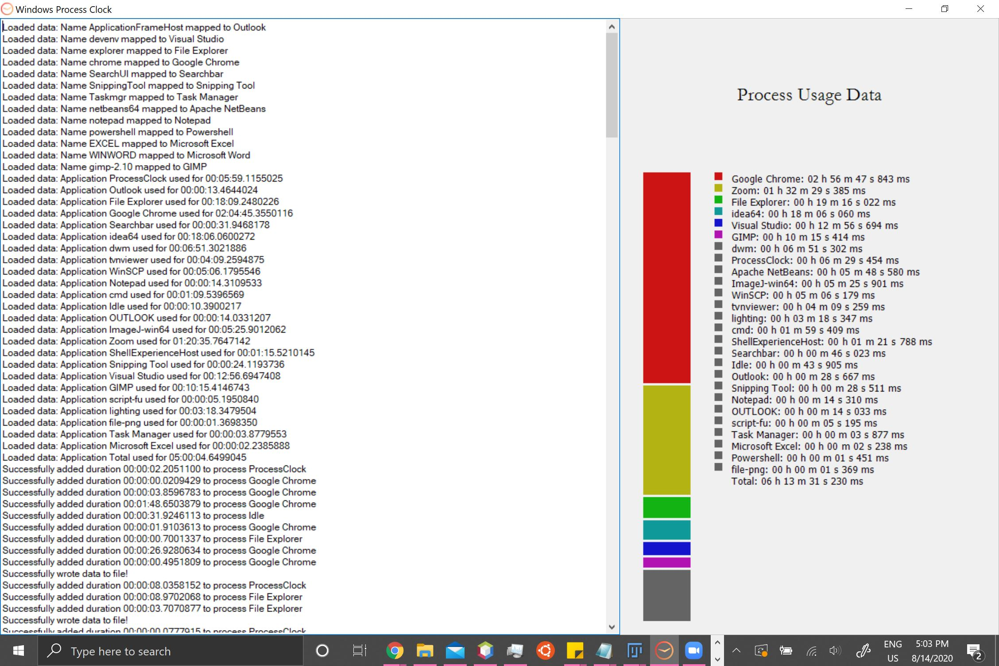

# Windows Process Clock
An open-source application to track productive time usage on Windows computers.

## Features
 - Records the amount of time spent on all processes in focus
 - Conserves resources and is accurate to at least the millisecond
 - Save and load data from files stored on computer
 - Detailed logs displayed in application window
 - Visualizer to display time spent on processes

## In Action

Left: Log recording data, Right: Graph with process times

## To-Do
 - Visualizer for stored data
 - Statistics on use
 - Config file to classify processes
